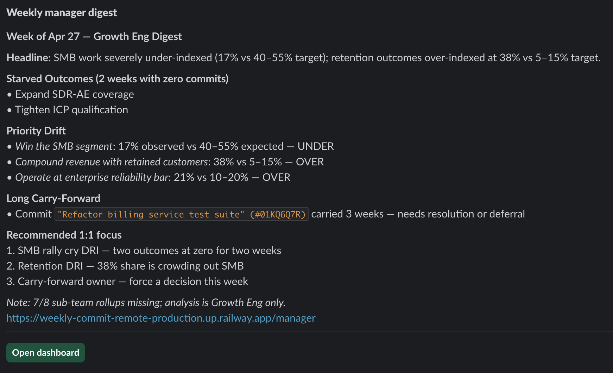

# Throughline — Weekly Commit Module

**[Live demo](https://host-production-963c.up.railway.app)** ·
**[App](https://weekly-commit-remote-production.up.railway.app)** ·
**[Architecture deep-dive](https://host-production-963c.up.railway.app/architecture)** ·
**[API health](https://api-production-0faba.up.railway.app/actuator/health)**

Production-ready weekly-planning system that replaces 15Five. Every weekly
commit is foreign-keyed to a Supporting Outcome inside the org's RCDO
hierarchy (Rally Cry → Defining Objective → Outcome → Supporting Outcome),
enforcing strategic alignment as a structural property — not a self-report.

The product layers an AI Strategic Alignment Copilot over that structured
graph: ICs get inline outcome suggestions, drift warnings, and quality lints
as they draft; managers get a pre-digested weekly digest, alignment-risk
alerts, and a portfolio review that no unstructured-text tool can produce.

> **Architecture + decision log:** [`CLAUDE.md`](./CLAUDE.md) for the operating
> rule and reframe; [`docs/architecture-decisions.md`](./docs/architecture-decisions.md)
> for the 33-row requirement-treatment table.

## Why this exists

15Five collects weekly check-ins as unstructured text; managers infer
alignment manually. Manager attention is the scarce resource. ICs + the AI
copilot do the alignment work as a natural byproduct of planning. The
manager's default view is a pre-digested strategic dashboard — they drill in
only when something is genuinely worth their attention.

## Differentiation vs. 15Five

15Five operates on unstructured text. Throughline operates on a **structured
strategy-to-execution graph** — every commit is FK-linked to a Supporting
Outcome. The AI generates insights 15Five structurally cannot:

- *"Outcome 3.2 received 47% of org effort this week, Outcome 3.1 received
  zero."*
- *"This commit has been carry-forwarded four weeks running."*
- *"Sarah's portfolio is 71% concentrated on a single Outcome while team
  priority signal expects 30–50% on enterprise."*

## Repo layout

```
apps/host                       # Module Federation host (React 18 + Vite 5)
apps/weekly-commit-remote       # Module Federation remote (the actual app)
packages/shared-ui              # Federation singleton: store, hooks, components
packages/shared-types           # Backend DTO mirrors
packages/shared-deps-versions.json  # Single source of truth for MF singletons (P22)
services/api                    # Spring Boot 3.3, Java 21, JPA, Flyway
docs/                           # Decisions, AI spec, patches, source-control, orchestration
infra/                          # Terraform (AWS swap path) + Helm chart   [Phase 8]
cypress/                        # Cucumber/Gherkin acceptance specs        [per phase]
evals/                          # AI eval harness (inline runner; P41)     [Phase 5]
```

## Run locally

Prerequisites: Node 22.17.x (`.nvmrc`), Yarn 1.22+, Java 21, Docker.

```bash
yarn install
docker compose up -d                        # Postgres 16.4 on :5432
cp .env.example .env.local                  # then fill what you have
cd services/api && ./gradlew bootRun        # backend on :8080
cd ../.. && yarn dev:remote                 # remote on :5174
yarn dev:host                               # host on :5173 → open http://localhost:5173
```

### Continue-and-defer (no credentials? still runs)

The build never blocks on missing credentials. Stub providers activate
automatically:

| Credential        | When unset                                     |
|-------------------|------------------------------------------------|
| `AUTH0_*`         | `MockJwtDecoder` + `MockAuth0Provider`         |
| `ANTHROPIC_*`     | `StubAnthropicClient` (deterministic fixtures) |
| `SLACK_WEBHOOK_*` | `LogChannel` (logs to SLF4J INFO)              |

Drop real values into `.env.local` whenever convenient; integration tests
flip green automatically. See [`docs/orchestration-plan.md`](./docs/orchestration-plan.md).

## Tests

- **Backend.** JaCoCo ≥80% line coverage. `./gradlew check` runs unit +
  contract + Cucumber suites.
- **Frontend.** Vitest ≥80% lines/branches/functions/statements. `yarn nx run-many -t test`.
- **E2E acceptance.** Cypress + Cucumber/Gherkin. `.feature` files in
  `cypress/e2e/**` are **deliverable spec artifacts**, not just tests.
- **AI evals.** `yarn evals` runs `evals/runner.ts` against the real Anthropic
  API at temperature 0, N=3, ≥2/3 pass per scenario. Fixtures in
  `evals/fixtures/{t1..t7}/`; latest report in `evals/last-run.md`. See
  `docs/ai-copilot-spec.md` §Eval Harness and `docs/architecture-decisions.md`
  row 34 (P41) for why this substitutes for `@wkhori/evalkit`.

## Live deployment

- **Marketing landing:** https://host-production-963c.up.railway.app
- **App:** https://weekly-commit-remote-production.up.railway.app
- **API:** https://api-production-0faba.up.railway.app
- **Architecture deep-dive:** https://host-production-963c.up.railway.app/architecture

The app defaults to the IC persona on first visit; the persona bar at the top
of the page swaps between IC, Manager, and Admin views without re-auth so
each surface is one click away. Demo personas are minted via
`POST /api/v1/auth/demo-login` (HS256 tokens issued by the same Spring service
that verifies them), so Auth0 credentials are not needed to walk through the
demo.

### Sample weekly digest in Slack

The manager-facing weekly digest is the highest-leverage AI surface in the
product. Sonnet writes it from the structured rollup of every direct report's
locked-and-reconciled week; the manager sees it Friday afternoon and acts on
it Monday morning. Below is the current week's digest delivered to the
`#throughline-test` channel via the live Slack webhook.



The same payload powers the **Weekly digest** card on the manager dashboard;
the **Send digest to Slack** button on that card re-dispatches the latest
insight through the live channel without burning another LLM call.

## Methodology + decisions

- [`CLAUDE.md`](./CLAUDE.md) — methodology, the Rule, manager-burden reframe.
- [`docs/architecture-decisions.md`](./docs/architecture-decisions.md) — 33-row requirement-treatment table.
- [`PRD.md`](./PRD.md) — phase-by-phase build script.
- [`docs/prd-patches.md`](./docs/prd-patches.md) — 26 gap-audit patches.
- [`docs/ai-copilot-spec.md`](./docs/ai-copilot-spec.md) — full AI prompts, schemas, evals.
- [`docs/source-control-guide.md`](./docs/source-control-guide.md) — branching, commits, PRs.
- [`docs/orchestration-plan.md`](./docs/orchestration-plan.md) — execution contract.
